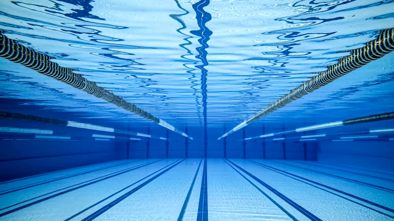
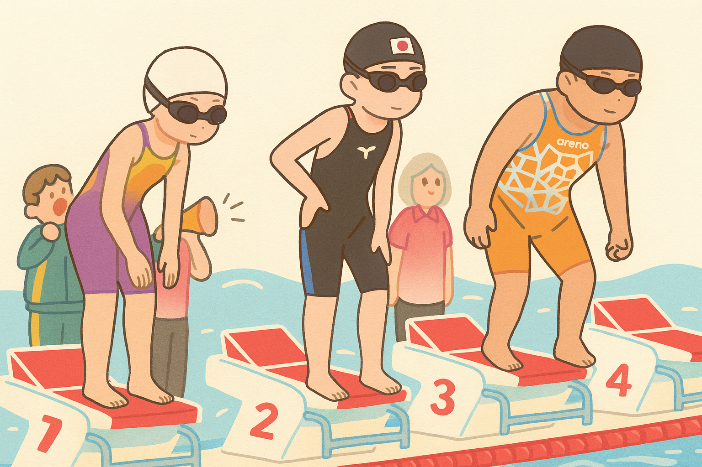
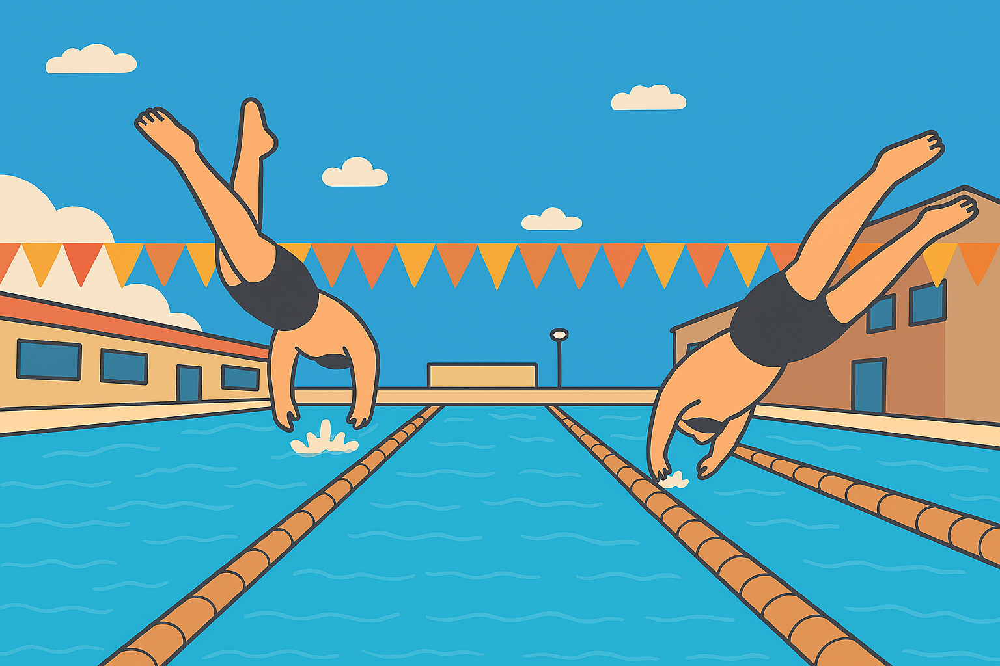
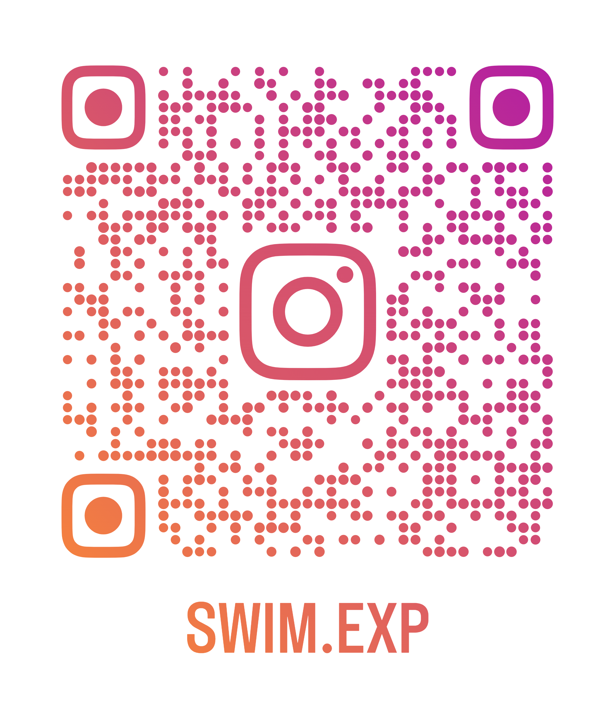
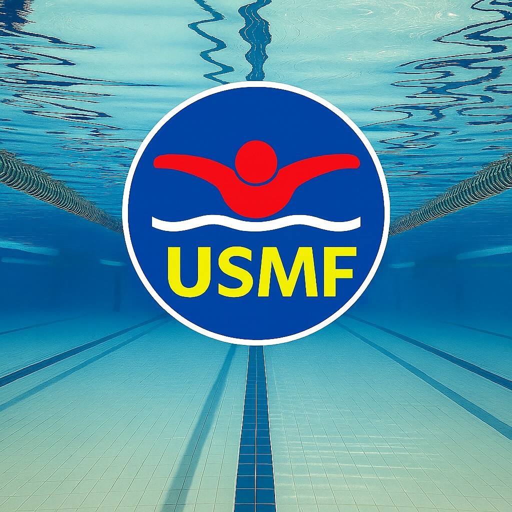
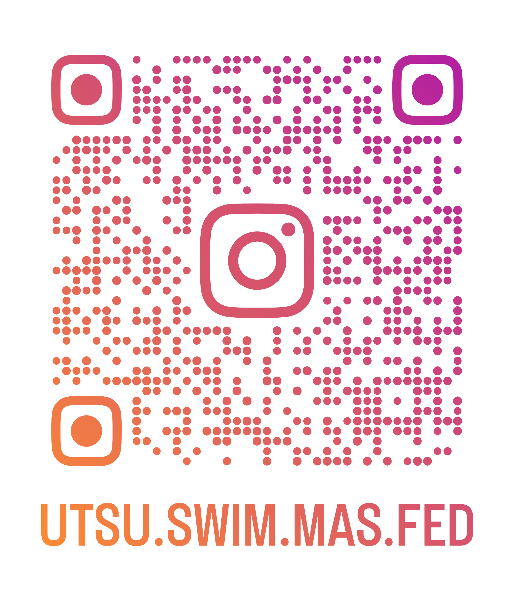
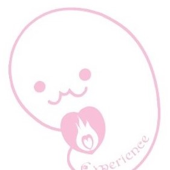
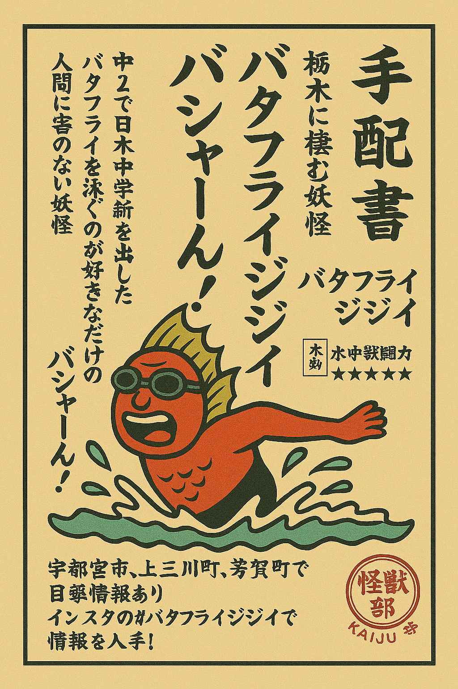
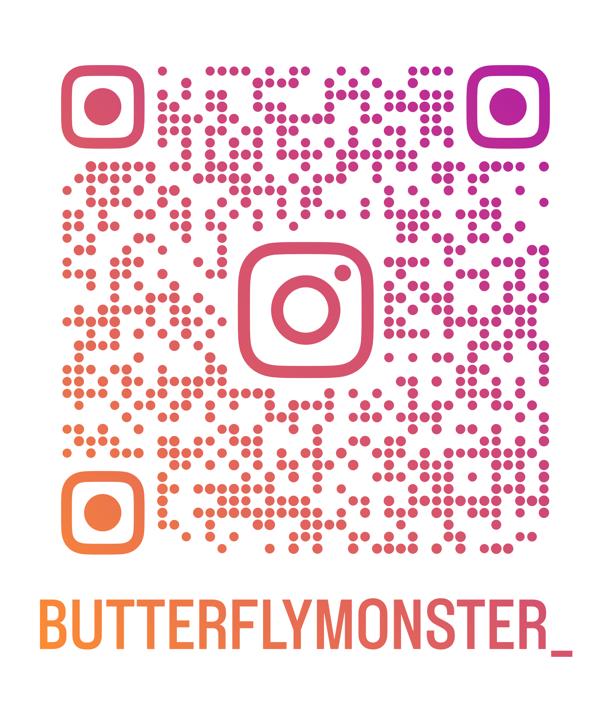

# 20260226TEST1
<html lang="ja">
<head>
<meta charset="UTF-8">
<title>SWIM EXPERIENCE HOME PAGE</title>
<meta name="viewport" content="width=device-width, initial-scale=1">
<meta name="description" content="”競泳が速くなりたい”選手のためのホームページです">
<link rel="stylesheet" href="main_style.css"> <link href="https://cdnjs.cloudflare.com/ajax/libs/lightbox2/2.7.1/css/lightbox.css" rel="stylesheet">
<link rel="stylesheet" href="https://cdnjs.cloudflare.com/ajax/libs/font-awesome/5.15.4/css/all.min.css"> </head>

<body>

<header>
  
</header>

<section class="hero"> 
　<h2> Life is tough, keep swimming.
  <small>～人生は常に大変だ。でも水泳は速く美しく泳ぎたい～</small></h2>
  
  </section>

<main>

  
 <h1 class="white">
      <marquee behavior="scroll" direction="left">
        スイム・イクスピリエンスとは 直訳すると、【競泳を体験・実感する】の意味です。
        スイム・イクスピリエンスの活動を体験してもらい、選手の思い描いた理想通りに、上手く、速くなる実感を持つサポートを行います
      </marquee>
    </h1>
  

  

    <nav>
      <ul>
        <li><a href="index.html">ホームHome</a></li> <li><a href="#">スイム・イクスピリエンスDrop Down</a>
          <ul>
            <li><a href="#">スイム・イクスピリエンス 活動のきっかけ</a></li>
            <li><a href="#">こんな悩みを持つ競泳選手は、ぜひご相談ください</a></li>
            <li><a href="#">主な活動内容</a></li>
            <li><a href="#">エクスペリエンスちゃんとは</a></li>
            <li><a href="#">スイム・イクスピリエンスちゃんとは</a></li>
            <li><a href="#">栃木のプールに棲む妖怪 バタフライジジイとは</a></li>
            <li><a href="#">宇都宮スイムマスターズ連合【NEW!】</a></li>
            <li><a href="#">お問い合わせ先</a></li>
          </ul>
        </li>
      </ul>
    </nav>
  

    <section>
      <h3>スイム・イクスピリエンスの活動と内容</h3>
      <ul>
      <h4>
      <li>2025年7月から準備し、2026年4月より本格活動を計画中。</li>
      <li>現在の活動は、「主な活動内容」の中の、<strong>①競泳選手傾向診断 ②レース動画解析</strong>の２つを活動中です。</li>
      
その他の活動は、準備が整い次第、順次発信を行います。

      
スイム・イクスピリエンスの活動情報は、インスタグラムでも閲覧可能です

      <h4>
      

        

　　　　　<h3><strong>活動のきっかけ</strong></h3>
          <figure></figure>
          

          <h4>
●「競泳を通じた人格形成」 
            ●「戦略的な考えを持って、練習から大会のレースまで、選手自身が構築できる」 
            ●「競泳、スポーツを愛する選手であれば、身体の障害に関係なく競泳を楽しむ環境作り」 
            を理念として、競泳、スポーツを愛しているが、悩みある選手たちに、スイム・イクスピリエンスの経験・体験を通じて 
            選手としてだけでなく、「人間」として成長してほしいとの願いから、スイム・イクスピリエンスは誕生しました。

          </h4>
          

          
　　　　　
　　　　　

        

          <h3><strong>こんな悩みを持つ競泳選手は、ぜひご相談ください</strong></h3>
          <figure></figure>
          

          <h4>  
            
・レースでは、同じ合図で一斉にスタートしているのに、なんであんなに<mark>差が付いてしまうのか？</mark>

            
・私は、いつ、どのタイミングで、１番<mark>タイムが伸びるのだろう？</mark>

            
・今以上、これ以上<mark>本当にタイムは縮まらないのか？</mark>

            
・成人、おじさん、おばさんは、もう何をやっても<mark>水泳が上手に、綺麗に、速くなれないのか？</mark>

            
・水泳を続けているのに、なぜ私は、<mark>スイマー体型にならないのか？</mark>

          </h4>
            

              <a href="#" class="button">
                こんなお悩みの選手はクリック
              </a>
            

          

          

        
 

        <h3><strong>スイム・イクスピリエンスの主な活動内容</strong></h3>
        <h4>
            
<strong>①競泳選手傾向診断</strong>

            
 競泳選手に必要な要素を数値化して、選手自身の特性、速くなる、綺麗に、上手くなるポイントを

            
 <strong><mark>把握・見える化</mark></strong>することで、<strong><mark>今後の練習や、モチベーションに反映</mark></strong>できます

　　　　　　
最新の主な活動は、インスタグラムにて閲覧が可能です

　　　　　　<figure></figure>
          

        </h4>
            

              <a href="#" class="button"> 受診したい選手はクリック
              </a>
            

          

          

        
 
 
<strong>②レース動画解析</strong>

            
大会等で撮影された選手のレース動画を持ち込んでいただき

            
スイム・イクスピリエンスが、<strong><mark>客観的解析と、選手の良い点、今後のレースに生かす改善点</mark></strong>

            
のアドバイスを行います

            

              <a href="#" class="button">
                依頼したい選手はクリック
              </a>
            

            
<strong>③競泳選手に必要な要素の講習会<mark>（準備中）</mark></strong>

            
<strong>④競泳好きな人が集まる練習会（スイムイクス練）<mark>（準備中）</mark></strong>

          

　　　　
 

　　　　　<h3> 
宇都宮スイムマスターズ連合（USMF）について
</h3>
          <figure></figure>
          

          <h4>
            
マスターズ登録をしたチーム、個人登録、まだ登録していないけど、これからチャレンジしようとしている選手で、

            
「練習拠点や指導希望、練習内容、スタート練習」など、課題やお悩みをお持ちの方がいらっしゃるとお声掛けいただきましたので

            
水泳に関するお悩みを解決に導く<mark><strong>マッチングハブ機能が必要</strong></mark>との考えから

            
2026年から発足を開始します。

            
ご興味のある選手、チーム代表の方は、ぜひお問い合わせください

            
宇都宮スイムマスターズ連合の活動情報は、インスタグラムで閲覧可能です

　　　　　　<figure></figure>
          

         </h4>
            

              <a href="#" class="button">
                加入、ご相談したい選手、チーム代表はクリック
              </a>
          UP
        

        

        

        <h3>エクスペリエンスちゃんとは？</h3>
          <figure></figure>
          

        <h4>  
            
宇都宮市宝木町にある美容室 ヘアクリエイション エクスペリエンスのキャラクター。

            
スイム・イクスピリエンスちゃんとは、生き別れた弟。そら豆の形をした胎児です。

            
もっと詳しく知りたい方はこちら url:<a href="http://experience52.web.fc2.com/" target="_blank">http://experience52.web.fc2.com/</a>

            
ヘアクリエイション・エクスペリエンスのインスタグラムはこちら

　　　　　　<figure></figure>
          

        </h4>
        

        

        

          <h3>スイム・イクスピリエンスちゃんとは？</h3>
          <figure></figure>
          

          <h4> 
            
ヘアエクスペリエンスちゃんとは、生き別れた兄弟でお兄ちゃんだったことが最近判明した。

            
上三川町の小学校に通う、見た目は胎児だが、実は小学４年生。

            
たまたま行ったプールで、バタフライジジイ（詳細は、次の事項をご確認ください）に出会い、

            
泳ぐうちに、水泳の楽しさに目覚め、導かれる。

            
導かれてからは、泳ぐ力と速さが上がっていることを実感出来ているが

            
いざレースになると自分をコントロールしきれず、いまだ結果には結びついていない。

            
また、バタジイに導かれた影響なのかは不明だが、きちんと着用して泳いでも、泳ぎ終わるとゴーグルが吊り上がるようになった。

            
スイムイクスピリエンスちゃんの座右の銘は、<mark><strong>「嘘をつかない。人に迷惑をかけない。お友達には思いやりを持って接する」。</strong></mark>

          </h4>
　　　　　<figure></figure>
          

        

        

        

          <h3><strong>栃木のプールに棲む妖怪 バタフライジジイ（通称：バタジイ）</strong></h3>
          <figure></figure>
          

          <h4>  
            
言い伝えによると、栃木県競泳初の全国大会優勝者となったことで、腰に故障を抱えながら、今もなお、練習を続けレースにも出場しているという。
            バタジイは、筋力トレーニングを取り入れて、タンパク質の多量摂取の影響か、見た目と泳ぎがジジイではない＝人間ではなく妖怪だ と伝わる。

            
主に宇都宮市近辺で目撃例が多く、スポーツに真剣に向き合っている人には、友好的だとの情報もあるが、バタジイへのリスペクトを行わず、逆に攻撃したり、身の程を知らないオトナ相手には、
            バタジイのバタフライアームを使って、練習しているフリをして、首にラリアート攻撃をしてくるとの噂がある。

            
好きなこと、好きなものは、清らかな心を持つ人間との交流と、上三川町のらー麺 藤原家のつけ麺、抹茶スイーツ全般が好物で、プール以外の場でも多数の出没情報があるが、
            プール以外で遭遇できるのはレアなため、遭遇した人間には幸せが訪れるという幸運の妖怪でもある。
 
            
バタジイの口グセは、<mark><strong>「練習する以外の方法で、速くなれる選手いる？」「テクニック論なんて、速い選手でてきたら無意味」</strong></mark>（以上は、民明書房刊より）

            
バタフライジジイの出現・目撃・出没情報はインスタグラムで閲覧可能です

             <figure></figure>
          

         </h4>
          

        

        <h3>お問い合わせ先</h3>
        <form action="mailform.php" method="post">
        <h4>
　　　　 
お名前:<input type="text" name="name" id="name" required>

　　　　 
性別<input type="radio" name="sex" value="男" required>男<input type="radio" name="sex" value="女" required>女

　　　　 
メールアドレス:<input type="email" name="email" required>

         
依頼される項目<①競泳選手傾向診断----------②レース動画解析---------③競泳選手に必要な要素の講習会---------④競泳好きな人が集まる練習会（スイムイクス練）---------〇スイマー体型お悩み-------〇宇都宮スイムマスターズ連合の活動について-----〇その他>

　　　　 
具体的な悩みごと

         
<textarea name="message" cols="50" rows="5" required="required"></textarea>

         
<input type="submit" value="送信する">
 </form>
        </h4>
      
</section>
  
</main>

<footer>
  
 
    <nav class="footer-nav"> <ul>
        <li><a href="index.html#about">スイム・イクスピリエンス 活動のきっかけ</a></li>
        <li><a href="index.html#about">こんな悩みを持つ競泳選手は、ぜひご相談ください</a></li> <li><a href="index.html#about">活動内容</a></li> <li><a href="index.html#about">エクスペリエンスちゃんとは</a></li>
        <li><a href="index.html#about">スイム・エクスペリエンスちゃんとは</a></li>
        <li><a href="index.html#about">栃木のプールに潜む妖怪 バタフライジジイ</a></li>
        <li><a href="index.html#about">宇都宮スイムマスターズ連合について</a></li>
        <li><a href="index.html#about">お問い合わせ先</a></li>
      </ul>
    </nav>
    
&copy; Copyright 2025/07/14 Y. Omori
 

  

    

      

      
代表メールアドレス：swim exp@outlook.jp お急ぎの方は4yoomori@gmail.com 
      受付：基本、メール、または問い合わせフォームでの受付になります

      <ul class="sns1-parts">
        <li><a href="#"><i class="fab fa-line"></i></a></li>
        <li><a href="#"><i class="fab fa-youtube"></i></a></li>
        <li><a href="#"><i class="fab fa-instagram"></i></a></li>
      </ul>
    

</footer>

<a href="#"><i class="fas fa-angle-double-up"></i></a>

</body>
</html>
